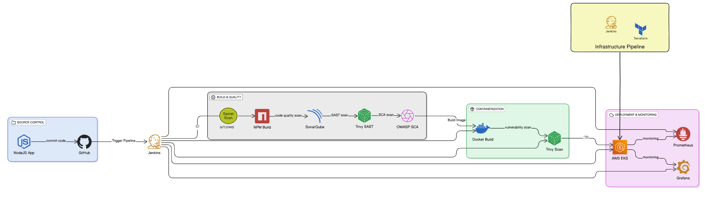

# DEVOPS MASTERCLASS BY EC2TECH

## DevSecOps CI/CD Pipeline Architecture for NodeJS Microservice

Join us for an exclusive DevOps Masterclass where we take you behind the scenes of building real-world, production-grade CI/CD pipelines—the backbone of modern software delivery.

Whether you're from a non-IT background, starting your DevOps journey, or already in IT and looking to switch domains, this session is designed to give you a hands-on preview of how DevOps works in the real world. This session will offer practical insights, live demonstrations, and career guidance to help you step confidently into the world of DevOps.

✅ **What You’ll Learn in This Masterclass:**

- Design and implement CI/CD pipelines ready for real-world production environments  
- Integrate security tools and testing into every stage of the DevOps lifecycle  
- Understand how to align CI/CD workflows with industry best practices  
- How to build your roadmap to becoming a DevOps Engineer  

🎯 **Who Should Attend?**

- Freshers or career switchers with zero DevOps background  
- IT professionals looking to level up their career to move into DevOps roles  
- Anyone eager to upskill with cloud-native, automation-driven technologies  

